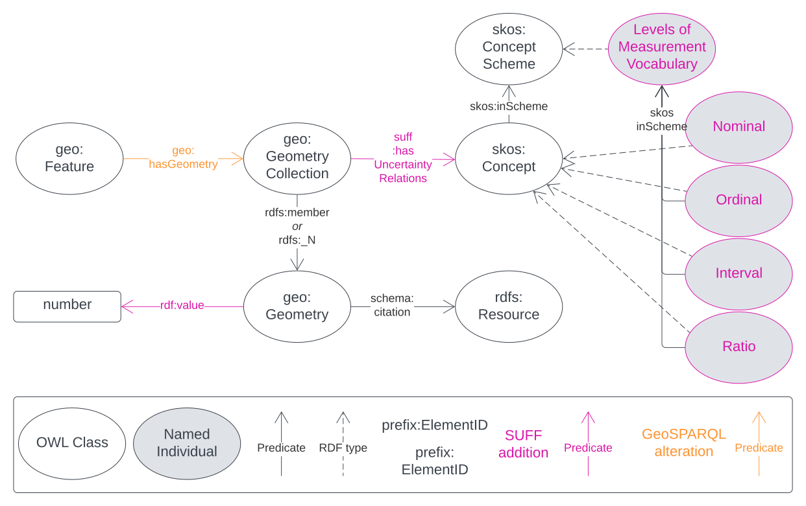

= Spatial Uncertainty for Features & Functions (SUFF) Model
:toc: left
:table-stripes: even
:sectids:
:sectanchors:
:sectnums:

:sectnums!:

[[fig-overview1]]
.An informal model overview diagram showing the major elements of this model

:sectnums:

include::01-metadata.adoc[]

include::02-preamble.adoc[]

include::03-introduction.adoc[]

include::04-principles.adoc[]

include::05-elements.adoc[]

include::06-rules.adoc[]

include::07-topo-functions.adoc[]

:sectnums!:

// include::50-annex-a-requirements.adoc[]

include::99-bibliography.adoc[]