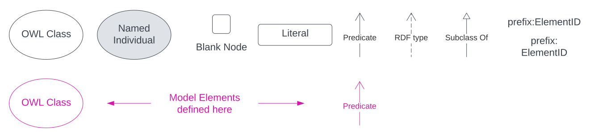

== Preamble

=== Abstract

This is a Semantic Web model that builds on elements of the GeoSPARQL 1.1 ontology to represent uncertainty in the location of geometric features, supporting cartographic representations as well as analytical functions.

=== Namespaces

This model uses the <<GEO, GeoSPARQL 1.1>> namespace and those of several others from well-known and mostly standardised ontologies as well as its own - `suff`. All namespaces used, and prefixes for them, are listed in the table below.

[width=100%, frame=none, grid=none, cols="1,4,5"]
|===
|Prefix | Namespace | Description

| `*suff:*` | `*http://w3id.org/suff/*` | *This model*
| `lom` | `https://linked.data.gov.au/def/levels-of-measurement/` | Levels of Measurement vocabulary namespace
| `ex` | `http://example.com/` | Non-resolving namespace for examples
| `geo` | `http://www.opengis.net/ont/geosparql#` | GeoSPARQL Ontology Namespace
| `geof` | `http://www.opengis.net/def/function/geosparql/` | GeoSPARQL Functions Namespace
| `owl` | `http://www.w3.org/2002/07/owl#` | Web Ontology Language ontology
| `rdfs` | `http://www.w3.org/2000/01/rdf-schema#` | RDF Schema ontology
| `sosa` | `http://www.w3.org/ns/sosa/` | Sensor, Observation, Sample, and Actuator ontology
| `schema` | `https://schema.org/` | schema.org model
| `skos` | `http://www.w3.org/2004/02/skos/core#` | Simple Knowledge Organization System (SKOS) ontology
| `time` | `http://www.w3.org/2006/time#` | Time Ontology in OWL
| `void` | `http://rdfs.org/ns/void#` | Vocabulary of Interlinked Data (VoID) ontology
| `xsd` | `http://www.w3.org/2001/XMLSchema#` | XML Schema Definitions ontology
|===

=== Conformance

This model's specification conforms to the https://w3id.org/profile/ontpub[OntPub Profile] which is a standard for ontology publication that mandates certain structural and metadata properties for the model as a whole and model elements.

==== Figures

Figures used in this document use the following key:

[[fig-figure-key]]
.Key of elements used in this Model's figures

==== Example Data

Example data used in this document, for instance in model element "Example" values, are <<RDF>> data presented in the <<TTL>> syntax.