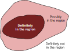
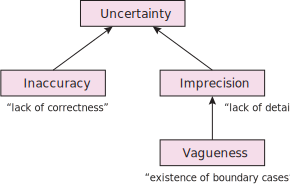

== Introduction

This model defines ways of arranging models elements from <<GEO, GeoSPARQL>>, other common https://en.wikipedia.org/wiki/Semantic_Web[Semantic Web] models such as <<SDO, schema.org>>, and some of its own elements to represent uncertainty in the location of geospatial features. 

For example, a region with a broad boundary (also called an indeterminate boundary, see <<BURROUGH-FRANK>>) is among the most fundamental representations of uncertainty in location. The figure below shows a simple example of such a region: the red central core is regarded as definitely in the region; the pink penumbra is possibly in the region; and everything else is definitely not in the region.  

[id="fig-bb",width="50%",align="center"]
.A classical region with a broad boundary.

Such representations are widely used in various simple models of uncertainty, including rough sets (<<WORBOYS-CEUS>>) and the so-called "egg-yolk model" of indeterminate RCC (region connection calculus) regions (<<COHN-GOTTS>>). The listing below provides the example data for the figure above. 

.Listing 1: Example data for the figure above
[source, turtle]
----
include::code/bb.ttl[]
----

The idea may be extended in a variety of different ways. For example, the following figure and code listing provide graphical and data views of a more complex uncertain feature created according to this model.

[id="fig-ex1",width="50%",align="center"]
.A more complex example of a geospatial feature with a broad boundary uncertainty, representing the location of an Indigenous people's homeland area. The polygons A, B, C, & D give different estimates for the extent of the area with A being the most certain and D the least.
image::img/ex1.svg[]

.Listing 2: Example data for the figure above
[source, turtle]
----
include::code/ex1.ttl[]
----

The following subsection in this Introduction describes the motivation for this work and the final subsection describes the structure of this specification.

=== Motivation

Representing uncertainty in location is one of the most longstanding—and tricky—topics in geographic information science. Many practical applications have the need to represent features with uncertain locations, including representing:

- the occurrence of mineral deposits, where the limitations of borehole sampling and interpolation may lead to uncertainty about the correct value at a location (_inaccuracy_)

- the occurrence of endangered species, where the exact location may need to be obscured for legal reasons and in order to protect endangered native species from damage or interference (_imprecision_)

- the traditional lands of First Nations people, which are intrinsically not definable by precise, measurable extents, and so representation by a region with a crisp boundary is not sensible (_vagueness_). 

These three examples relate to the three fundamental types of "imperfection" (uncertainty) in spatial data defined in <<WORBOYS-CLEMENTINI>>: inaccuracy (errors or a lack of correctness in data); imprecision (a lack of detail/exactness in data); and vagueness (a special case of imprecision, where precise boundaries between concepts remain ill-defined). Many other subtypes of uncertainty (such as bias, completeness, ambiguity, granularity, see <<DUCKHAM-BOOK>>) can be defined in terms of these three fundamental types, summarized in the figure below. 

[id="fig-bb",width="50%",align="center"]
.The typology of uncertainty (imperfection in information) after <<WORBOYS-CLEMENTINI>>.

=== Structure

GeoSPARQL defines spatial https://docs.ogc.org/is/22-047r1/22-047r1.html#_class_geofeature[`Features`] and https://docs.ogc.org/is/22-047r1/22-047r1.html#_geometry_class[`Geometry`] classes that can be used, with elements from other well-known Semantic Web models, for data with uncertainty in all the above scenarios. However, without dedicated methods for this, the representation and handling of it will differ in different implementations.

Consequently, this model provides:

. <<Principles>>: A series of principles describing the scope of what this model is intending to offer
. <<Elements>>: New Semantic Web Classes and Predicates defined here and guided reuse of Classes and Predicates from other models to represent uncertainty
. <<Rules>>: A series of rules that must be followed in the use of the elements of this model to ensure consistency in implementation
. <<Topological Functions>>: Definitions for topological functions that can be performed on spatial data with uncertainty, as represented by the Elements of this model in accordance with this model's Rules

Further, the model provides a https://docs.ogc.org/is/22-047r1/22-047r1.html#_class_geogeometrycollection[`Geometry Collection`] class which can be used to associate multiple geometries with a feature. This is the core of this model since multiple geometries for a feature can be used to convey location uncertainty in several ways - see the <<Principles>> below.

GeoSPARQL 1.1 does not, however, provide all the elements needed for deterministic representations of feature location uncertainty, nor does GeoSPARQL 1.1 describe how to perform topological functions on features with uncertain location representation. This model defines conventions for GeoSPARQL 1.1 element use, and introduces several new model elements, for this purpose.

Where spatial uncertainty is handled in mainstream non-Semantic Web GIS today, such as ESRI's ArcGISfootnote:[See the following ESRI product video at 8:03: https://www.esri.com/arcgis-blog/products/arcgis-pro/mapping/how-to-visualize-uncertainty-for-lines/], it is generally handled only cartographically and then only superficially - in the display of the data, not encoded within the data. This leads to the issue of reproducibility, where cartographic representations are not precisely defined, persistently stored, or reproducible on other systems.

By contrast, this model encodes uncertainty in the data itself. Together with the rules presented in the <<Principles>> section, the model can provide a basis for any software system to display uncertainty cartographically or analyse uncertainty spatially (such as probabilstic topological interactions). 

