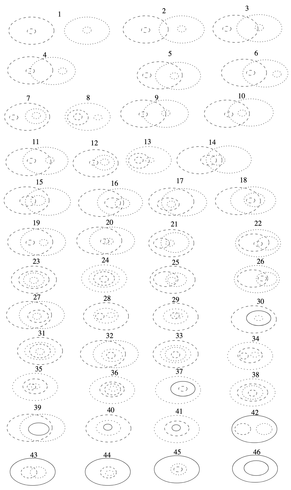
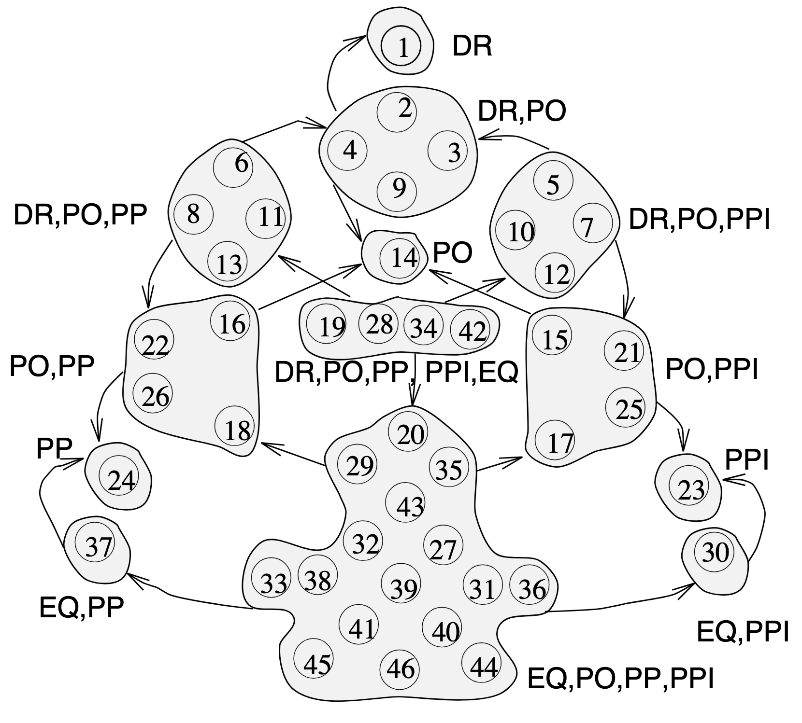

== Principles

This section give a series of principles describing the scope of what this model is aims to offer.

=== Uncertainty in location, represented using geometry

This model only directly addresses the representation of uncertainty in the location of spatial features, where that uncertainty can be captured using a set of geometries. 

The model does not address uncertainty in the values of other attributes or properties of features. Other ontologies do exist to provide for the representation of measurement uncertainty, including simple models such as <<SDO, schema.org>> include properties such as https://schema.org/marginOfError[marginOfError] for this purpose.

Further, this model is not intended to be used to represent uncertainty in location when a simple property associated with a single geometry would suffice. Such simple representations are already accessible through elements from <<GEO, GeoSPARQL>>, see:

* https://docs.ogc.org/is/22-047r1/22-047r1.html#_property_geohasspatialresolution[geo:hasSpatialResolution]
* https://docs.ogc.org/is/22-047r1/22-047r1.html#_property_geohasspatialaccuracy[geo:hasSpatialAccuracy]

=== Core mechanism

Uncertainty in the location of a feature is captured by linking the feature not to one geometry but to multiple - a geometry collection. Each geometry in the collection conveys part of the representation of the feature's location together with a value either being given in the data or inferrable due to the geometry's relative position in the collection.

The interpretation of the value is partly captured through three levels of measurement, as follows. 

==== Levels of measurement

The SUFF model recognises three levels of measurementfootnote:[We note, Steven's classic model recognises four levels of measurement, _Nominal_, _Ordinal_, _Integer_ or _Ratio_ (<<KIRCH>>). However, Steven's four levels of measurement are acknowledged to not provide a consistent representation of spatial data or uncertainty. Probabilities, for example, with two fixed points at 0 and 1, do not fit comfortably into any of Stevens' levels. Spatial densities, like population density, also don't fit well. Densities have one fixed point (zero) and can be compared like a ratio (e.g., 200 per square kilometer is twice as dense as 100 per square kilometer). But unlike a ratio, it is not in general possible to add population densities together (see <<DUCKHAM-BOOK>> for further information). Hence, while we follow the spirit, we do not follow the detail of Steven's four levels.] 
as defined in the <<Levels of Measurement, Levels of Measurement>> vocabulary in the <<Supporting Vocabularies>> section of this model. 

The three levels defined are:

. <<Levels of Measurement, nominal>>: which differentiates between items based only on their names or category
. <<Levels of Measurement, ordinal>>: which differentiates between items and assigns a (total) order on those items.  
. <<Levels of Measurement, quantity>>: which differentiates between items and assigns a magnitude to those items.  

The level of measurement will be indicated either directly by the predicate <<levelOfMeasurement, level of measurement>> on a <<GeometryCollection, Geometry Collection>> instance, or it will be divined from other properties of the geometries. The default value is _Nominal_.

=== Approximate topological relations

The <<GEO, GeoSPARQL>> standard provides both an ontology which defines spatial elements and predicates to indicate topological relationships between them and also function definitions that can be used to calculate those predicates.

For example, the predicate https://docs.ogc.org/is/22-047r1/22-047r1.html#sf_relations[`geo:sfWithin`] indicated that its subject is spatially _within_ its object where _within_ is the Simple Features Within relation defined by <<OGC-06-103r4>>. The related GeoSPARQL function is http://www.opengis.net/def/function/geosparql/sfWithin[`geof:sfWithin] which defines the parameters and results from the function used to calculate the `geo:sfWithin` relation between two spatial objects.

One objective of this model is to enable the definition of rules that propagate uncertainty in location through to levels of certainty in topological relation. There are an enormous range of different possibilities when computing such a relation in the literature, including <<COHN-GOTTS>>, <<CLEMENTINI-FELICE>>, <<BJORKE>>, <<WINTER>>, <<ROY-STELL>> to name but a few. 

==== Minimal method for approximate topological relation computation

For example, the <<COHN-GOTTS>> model of indeterminate regions distinguishes 46 topologically distinct relations between egg-yolk regions (see below). 

[id="fig-bb",width="50%",align="center"]
.The 46 distinct relations between two egg-yolk relations, from <<COHN-GOTTS>>.

In turn, this results in 13 distinct clusters of RCC5 relations between two egg yolk regions, given all possible "precisifications" of their boundaries, shown below. 

[id="fig-bb",width="50%",align="center"]
.Conceptual neighborhood of RCC5 relations between 46 topologically distinct egg-yolk relations, from <<COHN-GOTTS>>.

Based on this result, a minimal method for topological relation computation based on the simple egg-yolk model of indeterminate regions by and adopting a simple three-valued interpretation of "intersects" (i.e., definitely intersects, possibly intersects, definitely doesn't intersect) is as follows:

Given twe egg-yolk regions _A_ and _B_

. Compute the unique topological relation _R_ between _A_ and _B_ (numbered 1 .. 46)
.. If _R_ is in {1} then _A_ definitely doesn't intersect _B_
.. If _R_ is in {2, 3, 4, 5, 6, 7, 8, 9, 10, 11, 12, 13, 19, 28, 34, 42} then _A_ possibly intersects _B_
.. Else _A_ definitely intersects _B_

